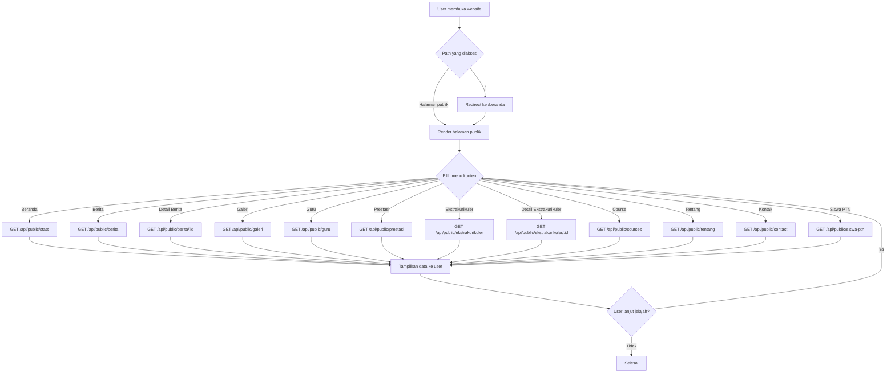
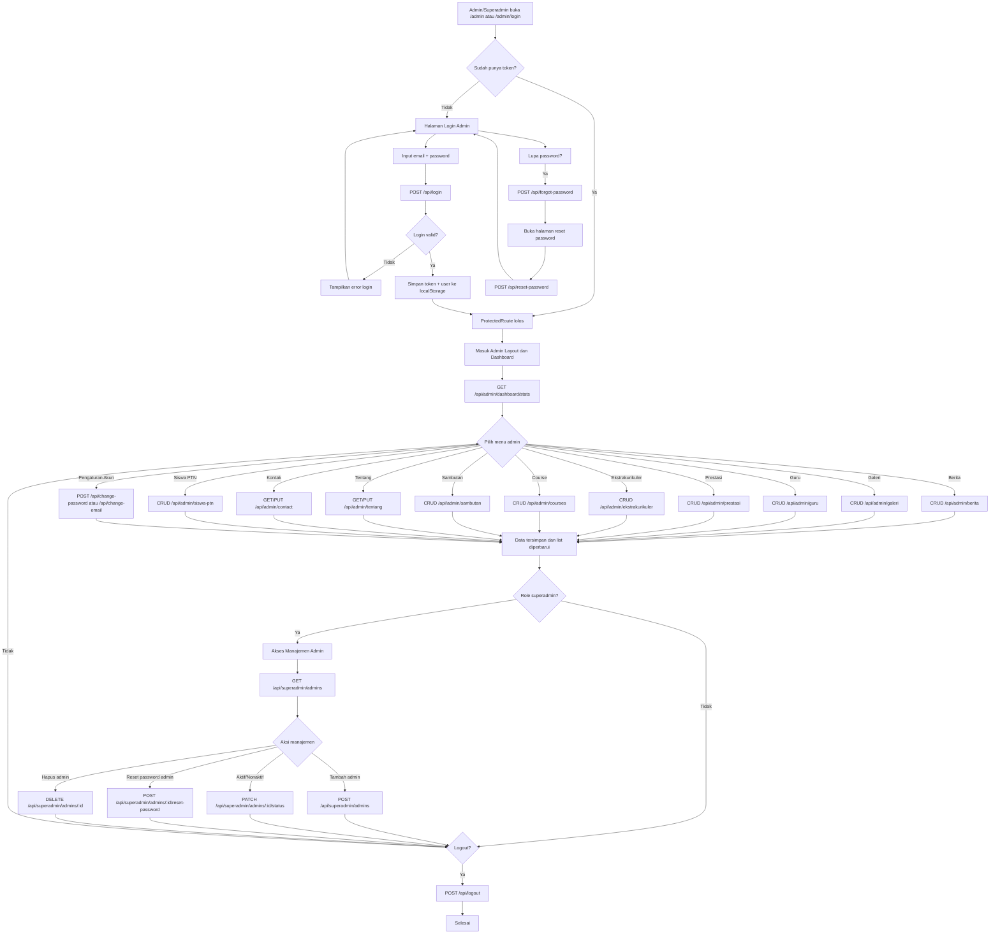

  # Flowchart User dan Admin

Dokumen ini merangkum alur utama pengguna publik (user) dan admin berdasarkan implementasi routing frontend React dan endpoint backend Laravel API.

## 1) Flowchart User (Publik)

## 2) Flowchart Admin (Admin + Superadmin)

## 3) Catatan Implementasi

- Route frontend admin dilindungi oleh komponen `ProtectedRoute` (cek token di localStorage).
- Jika token invalid/expired saat akses area admin, frontend menghapus state auth dan redirect ke `/admin/login`.
- Menu `Manajemen Admin` hanya muncul untuk role `superadmin`.
- Seluruh konten website publik dibaca dari prefix endpoint `/api/public/*`.
